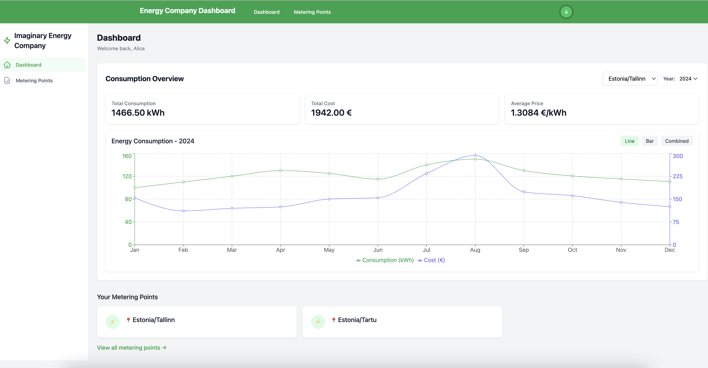

# ⚡ Energy Company Platform 🔋

A comprehensive energy management system that connects customers with their energy consumption data and metering points.

## 📊 Overview

This platform provides customers with tools to monitor their energy usage, manage metering points, and see energy pricing information. The system consists of multiple microservices for scalability and maintainability.

## 🏗️ Architecture

### Backend

- **Java 21**
- **Spring Boot** framework
- **Spring Cloud Netflix** for service discovery
- **PostgreSQL** databases
- **Liquibase** for database migrations
- **JWT** for secure authentication

### Frontend

- **React**
- **TypeScript**
- **Vite** Modern build tool and development server
- **Tailwind CSS** for styling
- **React Router** for navigation
- **React Hook Form** for form handling
- **Recharts** for data visualization
- **React Context API** for global state management (AuthContext)
- **React Hooks** useState, useEffect, useContext for component state management
- **Axios** Promise-based HTTP client for API requests

  **Testing**
- **Jest**: Testing framework
- **React Testing Library**: For testing React components
- **jest-dom**: Custom matchers for DOM testing

## 🧩 Components

### Backend Services

- **api-gateway**: Entry point for all client requests
- **authentication-service**: Handles user authentication and JWT token management
- **common**: Shared library with common utilities
- **consumption-service**: Manages energy consumption data and metering points
- **customer-service**: Handles customer information and user authentication and JWT token management
- **elering-adapter**: Integrates with [Estfeed Elering](https://estfeed.elering.ee/exchange-prices) for energy pricing data
- **eureka-server**: Service discovery for microservices

### Frontend Components

- User authentication
- Dashboard with consumption overview
- Metering points management
- Energy price tracking

## 🖼️ Application Preview



*Screenshot of the Energy Company dashboard showing consumption overview and metering points*

## 🚀 Getting Started

### Prerequisites

- Docker and Docker Compose
- Java 21 (for development)
- Node.js (for frontend development)

### Running the Application ⚙️

The entire application can be started using Docker Compose:

```bash
docker-compose up --build
```

This will start all backend services, databases, and the frontend application.

Once the application is running:
- Frontend: Access the web application at http://localhost:5173/
- Backend APIs: Available through the API Gateway at http://localhost:4000/
- Eureka Dashboard: Monitor services at http://localhost:8761/

### Demo Accounts 👤

The following demo accounts are available for testing:

| Email | Password |
|-------|----------|
| alice@example.com | energycompany |
| bob@example.com | energycompany |


## 💻 Development

Each microservice follows a modular structure:
- Service implementation
- Database migration application
- Liquibase changelog scripts


